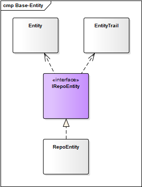

# Domain

## Overview

### Readings
- [Domain Analysis](https://docs.microsoft.com/en-us/azure/architecture/microservices/model/domain-analysis)
- [Tactical DDD](https://docs.microsoft.com/en-us/azure/architecture/microservices/model/tactical-ddd)


## Domain

| Structure of Domain

```
<Domain>
     - <AggregateRoot>
     - [<Aggregate>]
     - [<Entities>/<Entity n>]
     - [<AggregateRepository>]
     - [<Events>/<Event n>]

```

### Entities

**Entities**. An entity is an object with a unique identity that persists over time. For example, in a banking application, customers and accounts would be entities.

**Aggregates**. An aggregate defines a consistency boundary around one or more entities. Exactly one entity in an aggregate is the root. Lookup is done using the root entity's identifier. Any other entities in the aggregate are children of the root, and are referenced by following pointers from the root.

| Entity Features
- Audit Trail & Soft Delete
- Entity Key have to Guid type


### Repository & Unit Of Work

**Repository Design Pattern** in C# Mediates between the domain and the data mapping layers using a collection-like interface for accessing the domain objects.

The following illustration shows one way to conceptualize the relationships between the controller and context classes compared to not using the repository or unit of work pattern at all.




**The unit of work** class serves one purpose: to make sure that when you use multiple repositories, they share a single database context. That way, when a unit of work is complete you can call the SaveChanges method on that instance of the context and be assured that all related changes will be coordinated. All that the class needs is a Save method and a property for each repository. Each repository property returns a repository instance that has been instantiated using the same database context instance as the other repository instances.

**IDbContext** is a UnitOfWork 

